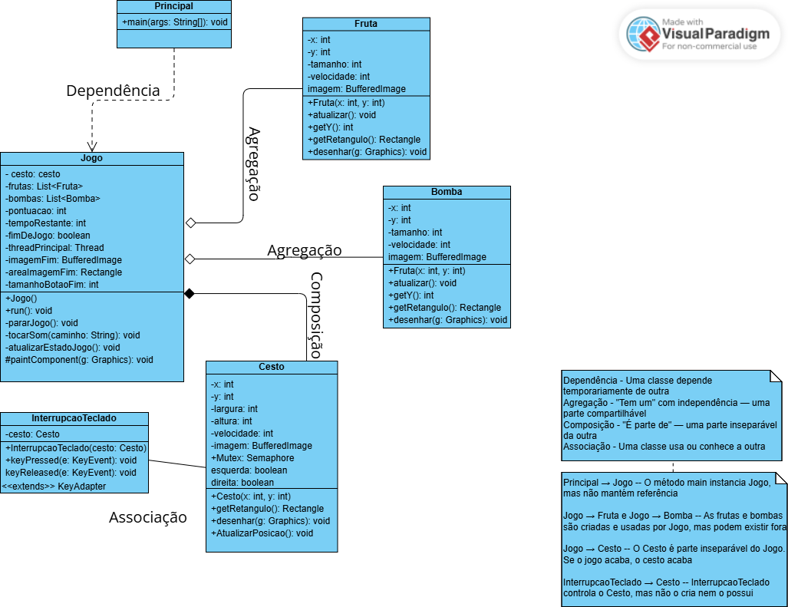
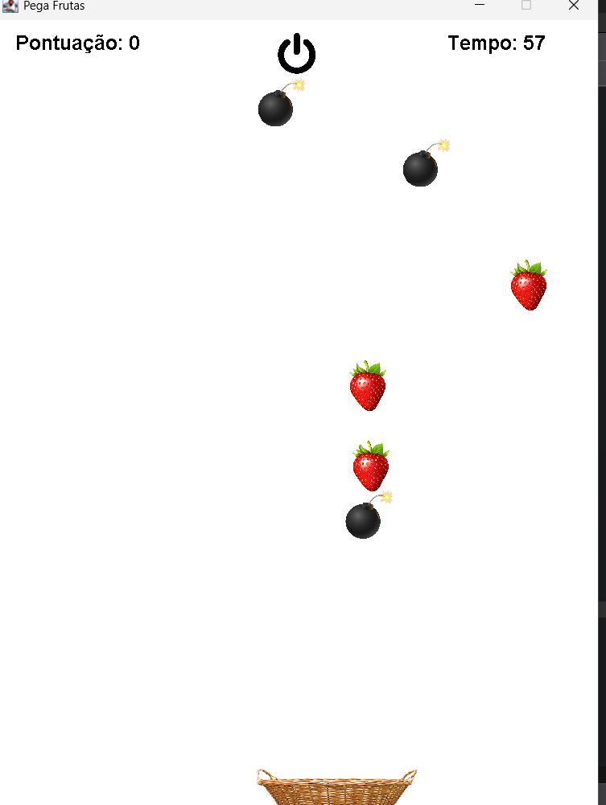

# 🍓 jogo-pega-frutas

Projeto desenvolvido para a disciplina **Programação Orientada a Objetos II** com o objetivo de aplicar conceitos avançados de Java e Programação Orientada a Objetos por meio da criação de um jogo interativo.

## 🎮 Sobre o jogo

O **Pega-Frutas** é um jogo em que o jogador controla um cesto que deve capturar frutas que caem do topo da tela, enquanto desvia de bombas. O jogo possui tempo limitado, pontuação, som, imagens e finaliza automaticamente ao acabar o tempo ou ao clicar no botão de encerramento.

---

## 🧩 Funcionalidades implementadas

- Movimento de objetos na tela (Frutas, Bombas, Cesto)
- Controle por teclado (esquerda e direita)
- Threads para movimentação dos elementos
- Região crítica com uso de **Semáforo (Mutex)**
- Contador de tempo na tela (Temporizador)
- Sistema de pontuação
- Detecção de colisões
- Tela de **Fim de jogo**
- Inserção de sons e imagens
- Botão de encerrar jogo

---

## 🧱 Arquitetura (UML)



- `Principal`: inicia o jogo (classe com método `main`)
- `Jogo`: controla a lógica principal do jogo (movimentação, pontuação, tempo, som, fim de jogo)
- `Fruta` e `Bomba`: herdam a estrutura de elementos que caem e interagem com o cesto
- `Cesto`: controlado pelo jogador, com movimentação e colisão
- `InterrupcaoTeclado`: escuta eventos de teclado para mover o cesto

---

## 🚀 Como executar

1. Clone este repositório:
   ```bash
   git clone https://github.com/EmellyCaixeta/jogo-pega-frutas.git
   cd jogo-pega-frutas
   ```

2. Compile os arquivos Java:
   ```bash
   javac *.java
   ```

3. Execute o jogo:
   ```bash
   java Principal
   ```

---

## 🛠️ Tecnologias e recursos utilizados

- Java (Swing, Threads, Timer, BufferedImage)
- Programação Orientada a Objetos
- Semáforo com `java.util.concurrent.Semaphore`
- Manipulação de som com `Clip`
- Leitura de teclado com `KeyAdapter`
- Modelagem UML com Visual Paradigm

---

## 📚 Requisitos atendidos da atividade

| Requisito                          | Status |
|-----------------------------------|--------|
| Paradigma Orientado a Objetos     | ✅     |
| Diagrama UML                      | ✅     |
| Movimento de objetos              | ✅     |
| Threads                           | ✅     |
| Região Crítica / Semáforo (Mutex) | ✅     |
| Temporizador com cronômetro       | ✅     |
| Sistema de pontuação              | ✅     |
| Fim de jogo com mensagem          | ✅     |
| Inserção de som e imagens         | ✅     |
| Leitura de teclado                | ✅     |
| Botão para encerrar jogo          | ✅     |

---

## 📷 Captura de tela



---

## 👤 Autor

Desenvolvido por **Emelly Caixeta** 
Disciplina: Programação Orientada a Objetos II  
Faculdade: Anhanguera   

---

> Este projeto foi desenvolvido como parte de uma avaliação acadêmica e não possui fins comerciais.
